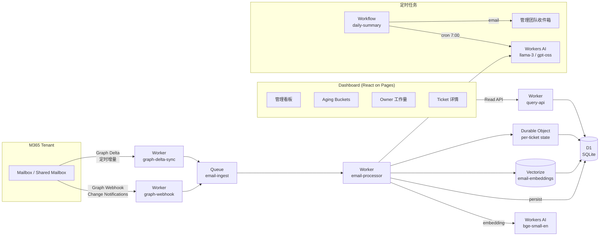

# AI Ticketing Dashboard (M365 Email) — 可行性分析

> Phase 1 范围：以 Microsoft 365 邮箱作为唯一数据源，做管理看板 + 自动聚合 + AI 抽取。
> Deliverable：Dashboard + 每日/每周管理摘要。

---

## 1. 可行性结论

| 维度 | 结论 |
|------|------|
| 技术可行性 | ✅ 完全可行。所有依赖组件（Graph API / LLM / Vector DB / Workflow）都已成熟 |
| 推荐栈 | Cloudflare 全家桶（Workers + D1 + Durable Objects + Vectorize + Workers AI + Workflows），前端 React on Pages |
| MVP 工期 | 3–4 周（1 工程师） |
| 月度成本 | < $50（Workers + D1 + Workers AI 都按用量计费，Phase 1 量级很轻） |
| 最大风险 | M365 Tenant Admin 授权 + 主数据（Dealer/Model）是否齐全 |

---

## 2. 整体架构

---

## 3. 技术组件 & 推荐栈

| 模块 | 推荐方案 | 备选 | 复杂度 |
|------|---------|------|--------|
| 邮箱接入 | Microsoft Graph（Webhook + Delta Sync） | IMAP polling | 中 |
| 鉴权 | Azure AD App Registration + Client Credentials | OAuth delegated | 低 |
| 工单聚合 | `conversationId` + Vectorize 语义合并 | 仅 thread | 中 |
| 元数据抽取 | Workers AI（LLM）+ 字典 | GPT-4o API | 中 |
| 工单状态机 | Durable Object（per-ticket） | D1 only | 中 |
| 主存储 | D1（SQLite） | Postgres | 低 |
| 向量库 | Vectorize | pgvector | 低 |
| Dashboard | React + Cloudflare Pages | Vercel | 低 |
| 报表/告警 | Workflows（cron）+ Email/Teams Webhook | 手动 | 低 |
| 鉴权（前端） | Cloudflare Access + JWT | Auth0/Clerk | 低 |

---

## 4. Ticket 聚合策略（核心难点）

| 层级 | 做法 | Phase | 准确率预期 |
|------|------|-------|-----------|
| L1 | Outlook `conversationId` 直接聚合（同一会话 = 1 Ticket） | 1 | 70–80% |
| L2 | Workers AI 生成邮件 embedding，Vectorize 相似度 > 0.85 自动合并跨线程 Case | 2 | 85–92% |
| L3 | LLM 跨线程判断是否同一 Case（few-shot） | 2/3 | 92%+ |

**Phase 1 先做 L1**——保守但可控，先验证 Dashboard 价值，再投入 AI 合并。

---

## 5. 元数据抽取策略

| 字段 | 抽取方式 | 备注 |
|------|---------|------|
| Dealer/Customer | 邮箱后缀匹配 → 签名块正则 → LLM 提取 → 查主数据 normalize | 需要 Dealer Master 表 |
| Machine Model | 正则 + 型号字典（SKUs.csv）→ LLM 校验 | 需要 Machine Model 字典 |
| Category | LLM 分类（few-shot，5–10 example） | Service / Warranty / Sales / Parts / Technical |
| Owner | 规则引擎：Dealer → Sales；Category → Service/Warranty specialist | 需要路由规则表 |
| Status / Next Action | LLM 抽取 + 规则转换 | 状态枚举固定 |

---

## 6. Dashboard 指标分层

| 层级 | 指标 |
|------|------|
| **管理看板** | 本周新增 / 已关闭 / Active / Avg Cycle Time（按 Service / Warranty / Sales 分组） |
| **Overall** | 本周新增 / 已关闭 / Active / Pending / Hold / Overdue（3d / 7d / 14d） |
| **Aging** | 0–3d / 3–7d / 7–14d / >14d 四个桶，按 Category 分别统计 |
| **Owner 工作量** | Active 数 / 本周关闭 / 平均处理时长 / 最久未更新 |
| **Sales 专属** | 新增 Dealer / 跟进中 Dealer / 询价中 / 长期未跟进（>14d） |

---

## 7. 关键风险 & 缓解

| # | 风险 | 影响 | 缓解 |
|---|------|------|------|
| 1 | M365 Tenant Admin 不批 `Mail.Read` 应用权限 | 阻塞 | 提前 1 周申请，IT 出 consent form |
| 2 | Dealer / Machine Model 主数据缺失 | 抽取准确率 < 50% | **Phase 0 必做**：先整理 CSV 主数据 |
| 3 | 跨线程 Case 合并误判 | 重复 / 遗漏 | Phase 1 不做 L2/L3，只做 thread 聚合，人工可拆分 |
| 4 | Graph API Rate Limit | 大批量 backfill 卡住 | Delta 分页 + retry with backoff + Queue 削峰 |
| 5 | 历史邮件 backfill（数月） | 启动慢 / 成本高 | 限制在最近 30–60 天，超过则分批 |
| 6 | 邮件隐私 / 合规 | 法务风险 | D1 加密 at-rest，前端 Cloudflare Access 限内网 |
| 7 | Workers AI 中文 LLM 质量 | Category / Status 抽取偏差 | 关键字段（Category）兜底用 GPT-4o mini API |

---

## 8. Phase 1 MVP 范围（建议 3–4 周）

**包含**

- M365 Graph 接入（增量同步 + Webhook）
- Thread-based Ticket 聚合
- Category / Dealer / Model 抽取（LLM + 字典）
- Owner 规则路由
- 状态机（Open / Pending / Waiting Dealer / Waiting HQ / Closed）
- Dashboard：4 类核心指标 + Aging + Owner 工作量
- Overdue 邮件告警
- 周报自动生成（LLM 摘要 + 邮件发送）

**不包含（→ Phase 2/3）**

- ERP / 业务系统接入
- 跨线程语义合并（Vectorize）
- Teams 实时通知
- 多语言/多租户
- SLA 引擎

---

## 9. Phase 0 必做（启动前 1 周）

| # | 事项 | 输出 | 谁做 |
|---|------|------|------|
| 1 | 整理 Dealer 主数据清单 | `dealers.csv`（code, name, region, sales_owner_email, type） | 业务 |
| 2 | 整理 Machine Model 字典 | `models.csv`（model_no, series, category_default） | 业务 |
| 3 | 配置 Owner 路由规则 | `routing_rules.yaml` | 业务 + IT |
| 4 | 申请 Azure AD App | App Registration + Client Secret + Admin Consent | IT |
| 5 | 确定 M365 邮箱范围 | 用户邮箱列表 或 共享邮箱列表 | IT |
| 6 | 定义 Category / Status 枚举 | 一份枚举说明文档 | 业务 |

---

## 10. 工作量估算

| 阶段 | 天数 | 关键产出 |
|------|------|---------|
| Week 1: Graph 接入 + D1 Schema + 第一封邮件入库 | 5 | 邮件同步链路打通 |
| Week 2: 聚合 + 抽取 + 状态机 | 5 | Ticket 实体完整 |
| Week 3: Dashboard + Aging + Owner 工作量 | 5 | 可演示 |
| Week 4: 周报 + 告警 + 联调 + UAT | 5 | Phase 1 收尾 |

合计：**3–4 周（1 工程师）**；若有现成前端模板可压到 3 周。

---

## 11. 下一步建议（按推荐顺序）

| # | 选项 | 你能立刻拿到的产出 |
|---|------|-------------------|
| A | **Phase 1 详细技术方案**（DB schema、API 设计、prompt 模板、wireframe） | 一份可执行设计稿（1–2 天） |
| B | **最小骨架**：Cloudflare Worker + Graph Webhook + D1，跑通第一封邮件入库 | 可运行的 `hello-ticket` Worker（半天–1 天） |
| C | **Phase 0 主数据模板**（Dealer / Model / Routing 三张 Excel 模板 + 填写说明） | 三份可直接发给业务的表格（半天） |

最稳的推进路径：**先 A → 再 B → 启动 Phase 0 收集主数据 → 并行 C**。
